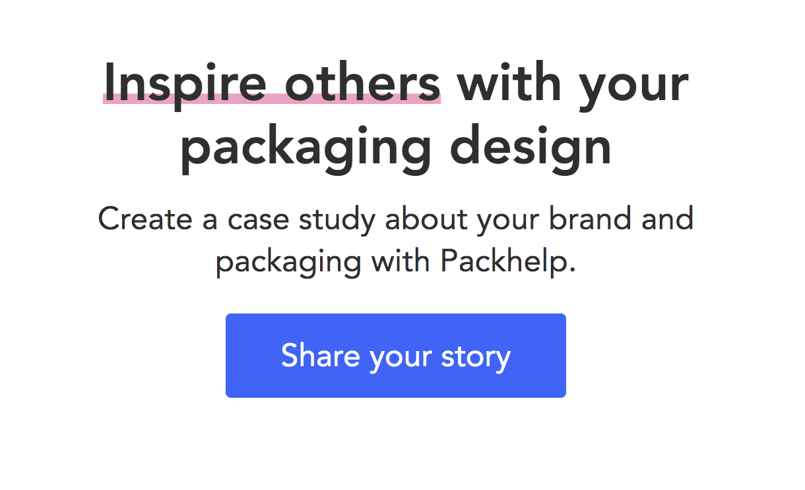
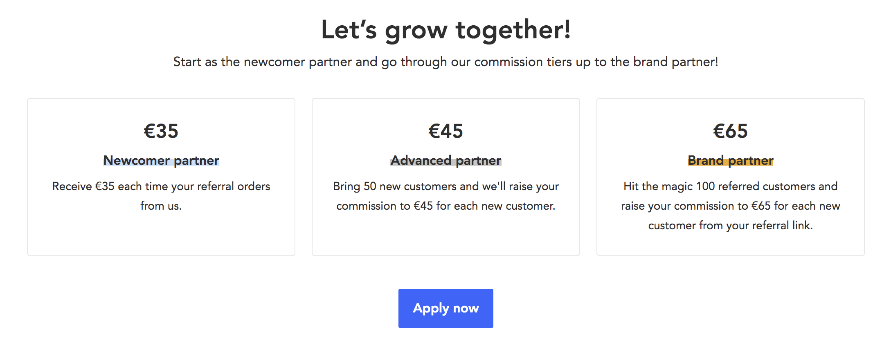
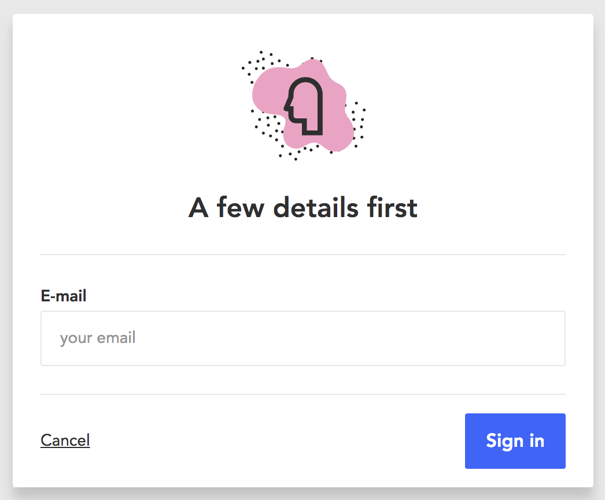

# Rozstawienie projektu

Requirements:
```
yarn - https://yarnpkg.com/lang/en/docs/install/
docker - https://docs.docker.com/get-docker/ - not required, use what you prefer
```

In root folder run:
```
cp wp-config-sample.php wp-config.php
docker-compose up -d
yarn install
yarn run dev
```

then open `http://localhost:8000/`, setup DB, login to wp-admin, select `Packhelp Demo Day` theme and it's done.
PHPMyAdmin is available under `http://localhost:8080/`

# Zadanie UI:

W tym zadaniu skupiamy się na UI. Do zakodowania są 2 sekcje w PHP oraz modal w React.

##### Sekcja 1


##### Sekcja 2


##### Modal


##### Modal powinien zawierać następujące pola:

- Imię*
- Nazwisko
- Adres e-mail*

*-pola obowiązkowe

Po kliknięciu sign-in trzeba zamockować request. Opcjonalnie można stworzyć endpoint w PHP, który zwraca predefiniowany response 200.

## Kolory
-  `#3b61ff`
-  `#f5a0c5`
-  `#2f2f2f`
-  `#eeab1d`
-  `#c5c5c5`
-  `#c7e0fe`

## Fonty

Roboto/ Lato

## Wymagania

- Strona musi być responsywna
- Nie można używać bibliotek typu Bootstrap. Interesuje nas czysty PHP/React/CSS(SCSS)

## Opcjonalnie

- Animacje
- Ustawianie danych do sekcji przez Wordpress
- Cokolwiek przyjdzie Ci do głowy ;)

# Zadanie Wordpress:

W tym zadaniu kładziemy nacisk na implementację PHP/JS niż stylowanie CSS - dlatego właśnie dostarczamy "gotowe" pliki HTML, aby nie tracić czasu na budowanie surowego HTML. Znajdziesz je w folderze `/templates/`. Przy wdrażaniu zwróć uwagę, aby elementy były możliwie reużywalne, oraz zdefiniowane. Zwracamy uwagę na dzielenie i paczkowanie kodu.

Głównym założeniem jest zrealizowanie implementacji ścieżki home-page -> shop-page -> oraz product-page, oraz kalkulator na stronie produktowej.
Dodatkowym elementem będzie dodanie i obsługa scss hover dla kafelków (w formie wymyślonej przez Ciebie). Zakładamy, że dodajemy hover "w jednym miejscu", a efekt będzie widoczny na wszystkich kaflach. 
Jeżeli wystarczy czasu to home-page -> blog-page -> blog-post.

Pomocne miejsce do pobierania zdjęć:
https://picsum.photos/

## Elementy globalne
- header - zawiera edytowalne elementy nawigacji, docelowo linkowanie do Home, Shop, oraz Blog - wspólny dla wszystkich stron.
- footer - analogicznie zawiera swoje elementy nawigacji, docelowo linkowanie do Terms of Service, Privacy Policy (mogą to być zwykłe strony contentowe z lorem ispum, ważne, aby linki były edytowalne i prowadziły w faktyczne miejsce na stronie).
- footer blogowy - dedykowany footer dla bloga, oraz stron blogowych, zawiera:
  - po lewej - 8 losowych artykułów - kliknięcie kieruje na artykuł
  - środkowa część - lista tagów - nie są to wszystkie tagi, a jedyie tych artykułów, które wyświetlają się na stronie

## Home Page - "home-page.html"
- Edytowalne wszystkie elementy będące na stronie z poziomu CMS, CTA maja możliwość przypisania zarówno title, jak i tego gdzie prowadzą.
- Lista produktów - lista najnowszych produktów limitowana do 9.

## Shop Page - "shop-page.html"
- slider - zawartość edytowalna z poziomu CMS.
- sekcja "Featured Products" - zawiera 4 wybrane z CMS produkty, oraz pozwala na wybór ich kolejności
- sekcja "Some Other Neat Products" - zawiera listę ostatnich 8 produktów, wykluczając 4 "Featured Products"
- sekcja "Our Newest Articles" - zawiera listę najnowszych artykułów

## Product Page - "product-page.html"
- edytowalne zdjęcie główne, tytuł, opis
- kalkulator (wyjaśniony poniżej)
- "Buy now" jest mockiem - załóżmy, że kliknięcie dodaje produkt do "koszyka", jednakże nie implementujemy tego w tym zadaniu.
- Share Facebook / Instagram - kliknięcie powinno udostępniać obecną stronę do danego social media.
- Pozostałe produkty - powinny wyświetlać się produkty, które posiadają jedną z przypisanych do produktu kategorii

### Kalkulator
Cena na kalkulatorze powinna reagować na zmiany size'u, oraz ilości. Kalkulator posiada predefiniowaną w CMS cenę podstawową, oraz 6 opcji size'ów, do każdego size'u przypisany jest przykładowy mnożnik:

nazwa | mnożnik
--- | ---
tiny | x0.75 
small | x1.0
medium | x1.5
large | x2.0
extra large | x3
enormous | x4 

Przykładowy sposób liczenia ceny: 
```
cena * mnożnik wielkości * ilość.
30$ * (small) x1.25 * 3 sztuki = 112,50$
```
Założenia:
- config ten musi być przekazywany z PHP do JS (nie może być definiowany w JS)
- musimy założyć dołożenie dodatkowych size'ów przyszłości, zmiany ich nazwy, oraz modyfikacji wartości mnożnika
- nie wszystkie size'y będą na wszystkich produktach (user w CMS wybiera jakie size'y obsługuje dany produkt)

## Blog Page - "blog-page.html"
- promoted article - 3 promowane artukuły (nie najnowsze)
- breaking news - 5 promowanych artykułów (nie najnowszych)
- latest stories
  - lista 6 artykułów z paginacją
  - po prawej stronie 3 wybrane produkty (lub jeżeli nie wybrane z CMS - dołożone brakujące do trzech).

## Blog Post - "blog-post.html"
- sekcja hero z header i subheader - umożliwia wrzucenie użytkownikowi zdjęcia w tło
- tytuł, data, content (zwykły tekst), autor
- previous and next post


# Podstawowa charakterystyka elementów

## Kafelek prduktowy / Produkt
Posiada atrybuty:
- tytuł / zdjęcie
- krótki opis używany na karcie produkt - inny niż opis pod tytułem na stronie produktowej
- cena - wyświetlana jest podstawowa w CMS
- kategorie
- permalink o strukturze `site-name/product/{product-name}`

## Kafelek artykułu / Artykuł
- autor artykułu (nie jest to użytkownik, który dodał post)
- tagi -> powinny prowadzić pod url `site-name/pin/{pin-name}`
- permalink o strukturze `site-name/article/{article-name}`
